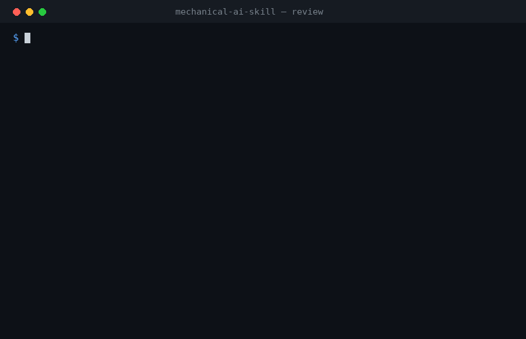
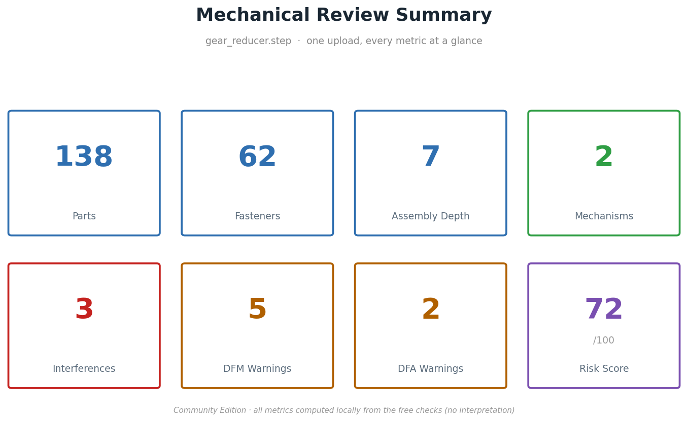
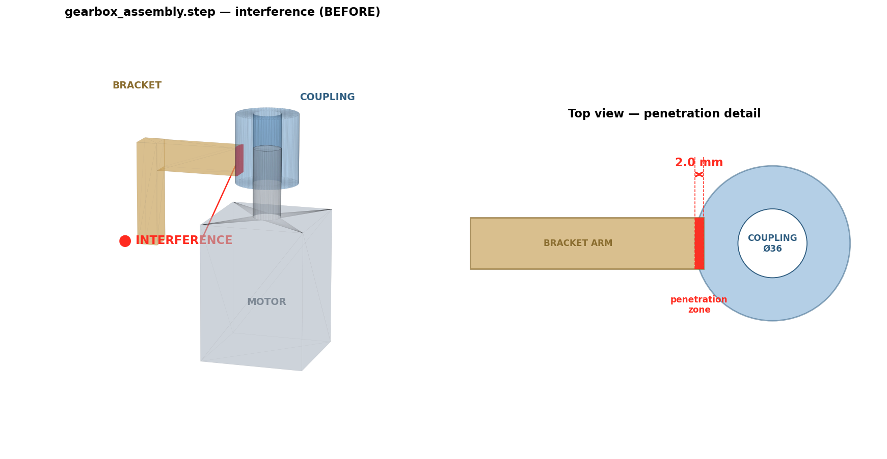
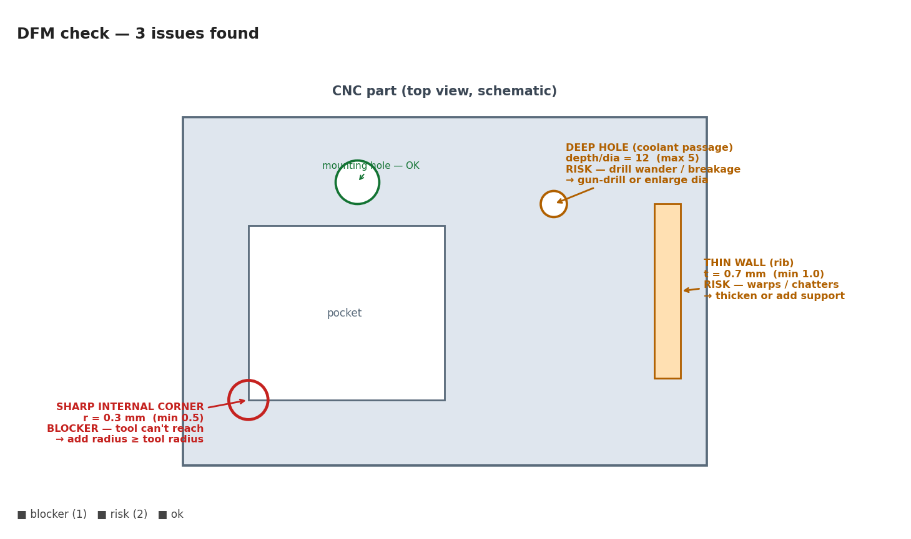
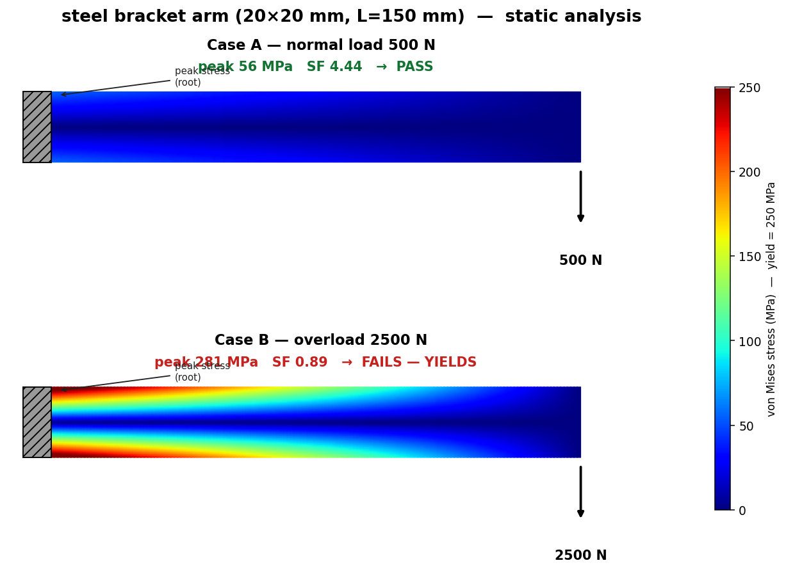
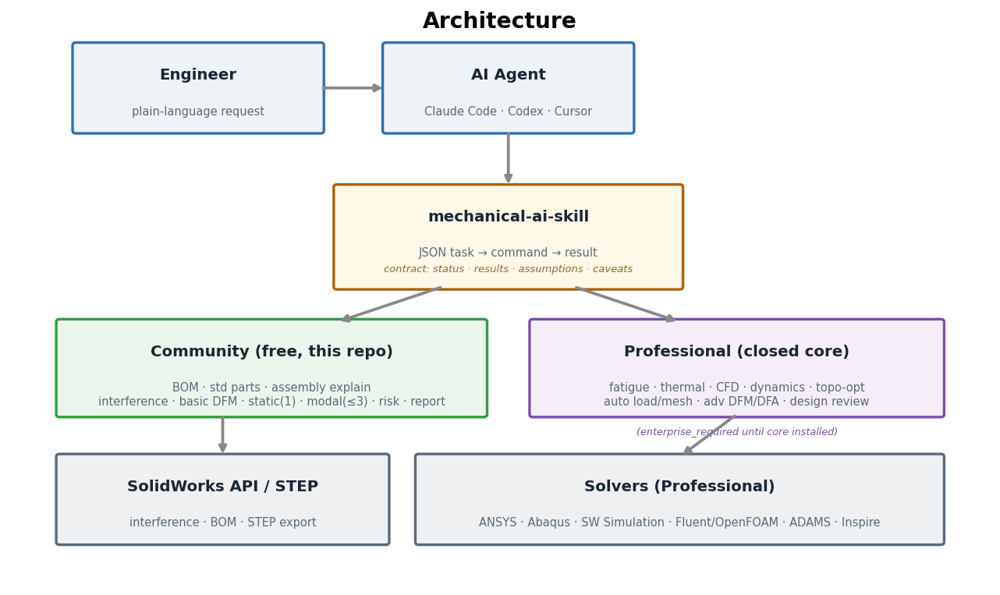

<p align="center">
  
</p>

# mechanical-ai-skill — Community Edition

<p align="center">
  <a href="LICENSE"></a>
  <a href="https://github.com/almightyshui/Mechanical-AI-Skill/actions"></a>
  
  
  
</p>

<p align="center">
  
</p>


**An AI agent that reviews your CAD — reads the assembly, builds the BOM, explains how it works, and finds the clashes.**

Point Claude Code, Codex, or Cursor at a SolidWorks assembly (or a STEP file) and ask in plain language: *What's in this? Make me a BOM. How does it work? Does anything interfere? Give me a report.* This skill drives the **real SolidWorks API** and returns structured results — with the honest caveats an engineer would attach.

```
You → AI agent → mechanical-ai-skill → SolidWorks API / STEP → results → report
```

This is the **open Community Edition** — an *AI Mechanical Engineering Review Skill*. It's fully functional on its own for CAD understanding, assembly diagnostics, and reporting.

## Free / Open features

Everything here is free and open source — no license, runs standalone:

- **Review summary** — one upload → every metric on one screen (parts, mechanisms, interferences, DFM/DFA warnings, risk score)
- **BOM generation** — bill of materials with quantities, straight from the assembly
- **Part count & standard-part ID** — total/unique counts; auto-flags screws, bearings, washers, etc.
- **Assembly analysis & explanation** — component + mate structure → working principle + suggested assembly order
- **Interference detection** — clashing pairs with overlap volume; mate errors, over/under-defined, dangling refs
- **Clearance check** — flags gaps below your minimum
- **Basic DFA** — part/fastener counts, assembly-depth complexity score, tool-clearance checks
- **Mechanism detection** *(experimental)* — identifies the type: gear train, timing belt, chain drive, lead screw
- **Assembly tree** — a clean text tree of the structure, so you can confirm the model parsed correctly
- **STEP export** — hand geometry off to downstream tools
- **Static analysis (single load case)** — real stress, deflection & safety factor for common cases
- **Modal analysis (first 3 modes)** — real natural frequencies + resonance check
- **Basic DFM** — deep holes, thin walls, sharp internal corners
- **Risk score** — a 0–100 score with a **transparent breakdown** (not a black-box number). Contributors:
    - Interference
    - DFM warnings
    - DFA complexity (part / fastener counts)
    - Tool accessibility
    - Assembly depth
- **Engineering report** — render any result to a clean PDF/HTML (status, tables, assumptions, caveats)

Upload a STEP, get **real analysis results** — not a demo. Advanced engineering — **fatigue, thermal, CFD, multibody dynamics, topology optimization, automatic load/constraint identification, advanced DFM/DFA, advanced risk scoring, automated design review, procurement** — is the **Professional Edition** (closed source). The commands for these ship in the open repo but return `enterprise_required` until the licensed core is installed — see the full breakdown in [Editions](#editions).

## See it work

Upload a STEP and get a one-glance review summary:




| Interference check | Basic DFM | Static + safety factor |
|---|---|---|
|  |  |  |
| clashing parts + overlap volume | deep holes / thin walls / sharp corners | stress, deflection, SF, PASS/FAIL |

**Real case study:** [Two-stage Gear Reducer Review](docs/CASE_STUDY.md) — one STEP file
→ 27-part BOM, 2 interferences, 2 DFM risks, shaft SF 5.67, risk score 71/100.


## Architecture

The skill sits between your AI agent and the real CAD/CAE tools, exposing one stable
JSON contract. Free capabilities compute locally; Professional capabilities delegate to
the licensed core (or return `enterprise_required`).



## Install

**Claude Code** (recommended — plugin, auto-updates via marketplace):
```
/plugin marketplace add almightyshui/Mechanical-AI-Skill
/plugin install mechanical-ai-skill
```

**Codex, Cursor, or any Agent Skills host:**
```bash
git clone https://github.com/almightyshui/Mechanical-AI-Skill
bash mechanical-ai-skill/install.sh all     # Claude Code + Codex (+ Cursor in a repo)
```
Per agent: `install.sh claude | codex | cursor`. Manual paths in [`INSTALL.md`](INSTALL.md).

**Zero config.** No solver, no SolidWorks? It still runs — open commands return a runnable macro (`deck_only`); gated commands say `enterprise_required`. Verify in 30 seconds:
```bash
git clone https://github.com/almightyshui/Mechanical-AI-Skill
cd mechanical-ai-skill
bash examples/demo.sh        # full review pass, no SolidWorks needed
```
It ends with a machine-readable summary an agent would report:
```json
{
  "status": "ok",
  "bom_unique_parts": 27,
  "interference_count": 2,
  "dfm_findings": {"blocker": 0, "risk": 2},
  "static_safety_factor": 5.67,
  "risk_score": 71
}
```

## What you do with it

### Make a BOM / understand a model
> **"Generate a BOM and explain this assembly."**

Walks the SolidWorks tree → bill of materials (item, part, quantity), unique-part and total counts, standard-part flags (screws, bearings, washers). For the **structure summary**, it returns the component + mate structure and a plain inventory (what is in the assembly, how parts are grouped). It describes *what is there* — interpreting *why it's designed that way*, the working principle, and power flow is the Professional Edition.

### Check an assembly
> **"Check this assembly for interference."**

Runs SolidWorks Interference Detection → each clashing pair with its overlap volume, plus mate errors, over/under-defined mates, dangling references, and clearance violations. Distinguishes a likely press-fit from a real clash. No SolidWorks on this machine? You get a macro to run, not a fake "all clear."

### Get a report
> **"Put that in a PDF."**

Any result — BOM or diagnostics — renders to a clean PDF (or HTML, zero-dependency fallback) with status, tables, assumptions, and caveats. Drop it into a design review.

## Editions

| Capability | Community (free) | Professional |
|---|:--:|:--:|
| BOM · part count · standard-part ID · assembly **structure summary** | ✅ | ✅ |
| Interference · mate · clearance diagnostics | ✅ | ✅ |
| STEP export · basic PDF/HTML report | ✅ | ✅ |
| **Static analysis** | single load case | multi-load, contact, nonlinear, auto-faces |
| **Modal analysis** | first 3 modes | unlimited modes, prestressed |
| **DFM** | basic rules | advanced rule library + DFA |
| **Risk score** | simple roll-up | criticality-weighted, code-aware |
| Fatigue · thermal · CFD · multibody dynamics | — | ✅ |
| Topology optimization / lightweighting | — | ✅ |
| Automatic load / constraint / mesh identification | — | ✅ |
| Automated design review · procurement · advanced report | — | ✅ |

Community commands for Professional capabilities exist and validate your task, but return `enterprise_required` with an upgrade note — they never crash and never fabricate output. Installing the licensed `mechanical_ai_core` package lights them up through the **same commands** (the skill auto-detects and delegates; see [`sdk/CONTRACT.md`](sdk/CONTRACT.md)).

## How it answers, and why you can trust it

| Status | Meaning |
|--------|---------|
| `ok` | ran, valid results |
| `needs_input` | required data missing — agent asks you, nothing ran |
| `deck_only` | SolidWorks not installed — macro generated + run command |
| `failed` | ran but errored — never reported as valid |
| `enterprise_required` | needs the Professional core — `upgrade` note, graceful |

Every default and auto-choice is in `assumptions`; every limit in `caveats`. Standard-part flags are name heuristics, marked for confirmation.

## For builders

Open, stable JSON contract — identical across agents. See [`AGENT_README.md`](AGENT_README.md) and [`sdk/CONTRACT.md`](sdk/CONTRACT.md). Open connectors in [`connectors/`](connectors); task templates in [`examples/`](examples). Minimal example:
```bash
cat > task.json <<'J'
{"stage":"0.1","capability":"generate_bom",
 "model":{"path":"C:/work/gripper.SLDASM","type":"assembly"},
 "units":"SI_mm_t","workdir":"C:/work/run1"}
J
python scripts/sw_understand.py --task task.json --out result.json
```

## Requirements
- Python 3 + bash (no pip deps for orchestration) — runs in Codex/Cursor sandboxes.
- PDF reports optionally use `reportlab` (else HTML fallback).
- Live SolidWorks operations need SolidWorks + `pywin32` (Windows); otherwise `deck_only`.

## Roadmap

**Available now (Community, free)**
- BOM, part count, standard-part identification, assembly explanation
- Interference / mate / clearance diagnostics
- Basic DFM (deep holes, thin walls, sharp corners)
- Static analysis (single load case), modal (first 3 modes)
- Simple risk score, PDF/HTML reports
- Claude Code plugin, Codex/Cursor install

**Next (Community)**
- Richer STEP parsing (part hierarchy, material metadata extraction when available)
- More DFM geometric checks; basic DFA (fastener counts, assembly steps)
- MCP server wrapper (BOM / interference / DFM / risk / report tools)
- A 30-second and a 3-minute demo video

**Professional (closed core)**
- Full/auto FE: fatigue, thermal, CFD, multibody dynamics, topology optimization
- Automatic load/constraint/mesh identification
- Advanced DFM/DFA rule libraries, advanced & FEA-aware risk scoring
- Automated design-review agent, engineering Q&A, procurement/costing
- Enterprise: custom standards, team dashboard, multi-user review

Have a request? Open a [feature request](.github/ISSUE_TEMPLATE/feature_request.yml).

## License
MIT — see [`LICENSE`](LICENSE). The Professional core is separately licensed.

> Skills run with your agent's permissions. Read [`SKILL.md`](SKILL.md) first; install only from sources you trust. This skill drives licensed CAD tools through their own APIs.
