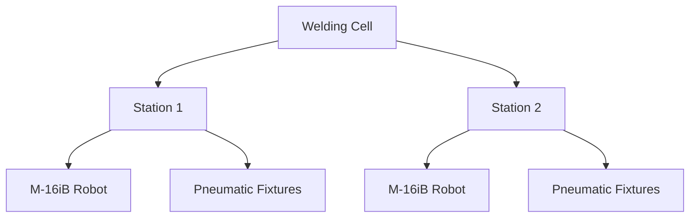

<p align="center">
  
</p>

<h1 align="center">AI Mechanical Engineering Review Skill</h1>

<p align="center">
  <b>Upload a STEP assembly. Understand the design. Review engineering risks. Generate reports.</b>
</p>

<p align="center">
  <a href="LICENSE"></a>
  <a href="https://github.com/almightyshui/Mechanical-AI-Skill/actions"></a>
  
  
  
</p>

<p align="center">
  
</p>

> **Not another CAD copilot.** Mechanical AI Skill focuses on engineering **understanding and review** — not geometry generation. It's a structured engineering-review layer that lets an AI agent (Claude Code, Codex, Cursor) reason about a mechanical assembly.
>
> Put differently: it's the **first AI-native engineering review layer for mechanical assemblies** — not a CAD tool, not a simulation tool, not a DFM tool, but the reasoning layer that sits between an AI agent and all of those.

```
Upload assembly → Understand assembly → Engineering review → Engineering report
```

## Why

Mechanical assemblies are hard for AI agents to reason about. A large STEP assembly can contain:

- Hundreds of components
- Complex mating relationships
- Hidden mechanisms
- Manufacturing risks
- Assembly complexity

**Mechanical AI Skill provides a structured engineering review layer** so an AI agent can go from a raw CAD file to an understanding of the design and a real engineering review — with the honest assumptions and caveats an engineer would attach. This is the open **Community Edition**, fully functional on its own.

## What it is — and is not

**Mechanical AI Skill is _not_:**
- ❌ A CAD modeling copilot
- ❌ A generative / geometry-creation tool
- ❌ A drawing or feature-modeling assistant

**Mechanical AI Skill _is_:**
- ✅ Assembly understanding (structure, BOM, mechanisms)
- ✅ Engineering review (interference, DFM/DFA, risk)
- ✅ Mechanical diagnostics (clashes, clearances, complexity)
- ✅ Engineering reporting (PDF / HTML)

## Example — one STEP in, a full review out

**Input:** a real 39 MB SolidWorks-exported STEP of a dual-station robotic welding cell. No SolidWorks, no geometry kernel — just the Community Edition reading the STEP. **Every figure is the actual output; nothing is invented.**

**Output** *(`review_summary`, written to `mech_review/review_summary.md` next to the STEP)*
```
EXECUTIVE SUMMARY
  142 unique parts · 357 instances · assembly depth 4

COMPLEXITY
  High — 357 instances, 142 unique parts, depth 4, 2 mechanism subsystems

MANUFACTURING MIX
  Custom (in-house) 78%  ·  Commercial / classified 22%

MECHANISMS
  Robot Arm (95%) · Pneumatic Cylinder (76%)

VENDORS
  FANUC (7) · Nook (4) · SCHUNK (3) · Bimba (3) · Banner (1) · Lincoln Electric (1)

CATEGORIES
  Robot/Arm 7 · Grippers 5 · Linear Motion 4 · Pneumatic 3 · Sensors 1 · Welding 1
  Custom Machined: 301065 (44) · 301066 (19) · 307070 (6) · 301060 (5) · 330001 (5)

RISK
  88 / 100 (higher = lower risk)

FINDINGS
  1. High part variety (Medium)
       Evidence: 142 unique parts across 357 instances
       Impact:   Higher inventory, sourcing, and assembly complexity
       Recommendation: (Professional)
  2. High custom-part ratio (Medium)
       Evidence: 78% of classified instances are custom (in-house)
       Impact:   Manufacturing cost and lead time driven by in-house parts
       Recommendation: (Professional)
  3. High instance count (Medium) · 357 instances · Recommendation: (Professional)
  4. Deep assembly structure (Low) · depth 4 · Recommendation: (Professional)
```

A plain STEP viewer shows you the geometry. None of them tell you, from the file alone, that this is a **dual-station FANUC M-16iB welding cell, 78% in-house parts, six vendors, high complexity, with four findings worth a closer look**. That's the difference between *viewing* a model and *understanding* an assembly.

Full write-up: **[Robotic Welding Cell](examples/robot_welding_cell/review.md)** — real 39 MB STEP, every number verbatim.

It can also emit the structure as a diagram that renders right here on GitHub:



## What the Community Edition already does

No license. Runs standalone. On a STEP file alone (no SolidWorks), it reads structure and runs approximate geometry checks; with SolidWorks it runs the production checks.

**Assembly understanding**
- **Executive Review** — one command (`review_summary`) reads the STEP and returns an engineer-facing verdict: assembly scale, detected mechanisms, vendors, categories, a name-level BOM, and a risk score — you don't pre-run the other checks, it orchestrates them
- **BOM generation** + part count + standard-part identification — works on a plain STEP with **no SolidWorks and no geometry kernel**: a real name-level BOM with true quantities (from assembly instance counts), honestly flagged as name-level (no volume/mass/material)
- **Assembly Structure Summary** — components, mates, grouping (*what is there*)
- **Assembly tree** — a clean structure tree to confirm the model parsed
- **Mechanism Detection (Experimental)** — gear train, timing belt, chain drive, lead screw, robot arm, linear slide, pneumatic cylinder, rotary table
- **Vendor summary** — detects component brands from names (FANUC, SCHUNK, SMC, THK, Banner …)
- **Assembly statistics** — top-level subassemblies and their instance counts
- **Component category summary** — counts by kind (motors, sensors, cylinders, robots …) — statistics, not a procurement list
- **Exploded structure graph** — a Mermaid diagram of the assembly tree (renders right in the README)
- **Adjacency graph** — which parts touch / are neighbours (geometric, from a STEP); without a geometry kernel it returns a clearly-labelled *hierarchy* graph (belongs-to, not touches) — never the two confused. The *force-flow* and *constraint* graphs are Professional

**Engineering review & diagnostics**
- **Interference detection** + **clearance check** (SolidWorks, or approximate from STEP)
- **Rule-based DFM** — deep holes, thin walls, sharp corners (on supplied feature measurements)
- **Basic DFA** — part/fastener counts, assembly-depth complexity, tool-clearance checks
- **Fastener checks** — thread-engagement (n×D rule) and missing-washer / missing-nut stack screens
- **Risk score** — 0–100 with a transparent breakdown (interference · DFM · DFA complexity · tool accessibility · assembly depth) — not a black-box number

**Simulation (real, analytical)**
- **Static analysis** (single load case) — stress, deflection, safety factor
- **Modal analysis** (first 3 modes) — natural frequencies + resonance check

**Reporting**
- **Engineering report** — any result → clean PDF / HTML with status, tables, assumptions, caveats

> **The Professional Edition is the Engineering Intelligence Layer.** Where the
> Community Edition answers *what is this assembly* (structure, mechanisms, vendors,
> first-pass review), Professional answers the questions an experienced engineer asks
> next:
> - **Why does this design exist?** — design-intent recognition, function identification
> - **How does force flow through it?** — automatic load-path and power-flow reasoning
> - **Where will it fail in real life?** — failure-mode prediction, FMEA, fatigue/thermal/CFD
> - **How should it be manufactured at scale?** — advanced DFM/DFA, cost, procurement
>
> Concretely that means fatigue, thermal, CFD, multibody dynamics, topology
> optimization, automatic load/constraint identification, advanced DFM/DFA, advanced
> risk scoring, automated design review, and procurement intelligence. Those commands
> ship here but return `enterprise_required` until the licensed core is installed.
> Full split in [Editions](#editions).

## How it compares

It isn't competing with CAD or CAE tools — it sits in a different layer (the AI agent's
reasoning layer) and *hands off* to them where they're authoritative.

| | What it's for | Runs without a CAD/CAE seat? | Driven by an AI agent? |
|---|---|---|---|
| SolidWorks / CAD | model & assemble geometry | no | no |
| ANSYS / Abaqus (CAE) | high-fidelity simulation | no | no |
| DFM checkers | manufacturability rules | usually needs the CAD seat | no |
| **Mechanical AI Skill** | **understand & review an assembly, then route to the right tool** | **yes (STEP-only fallback)** | **yes (Claude Code / Codex / Cursor)** |

The skill answers "what is this, is it sane, where should I look" in plain language from
a STEP file, then points you to SolidWorks for the authoritative interference check, or
to the Professional core for full FE / design review. It's the layer that was missing —
not a replacement for the tools underneath it. See [benchmarks](docs/BENCHMARKS.md).

## Architecture

The skill sits between your AI agent and the real CAD/CAE tools, exposing one stable JSON contract. Free capabilities compute locally; Professional capabilities delegate to the licensed core (or return `enterprise_required`).


## Install

**Claude Code** (recommended — plugin, auto-updates via marketplace):
```
/plugin marketplace add almightyshui/Mechanical-AI-Skill
/plugin install mechanical-ai-skill
```

**Codex, Cursor, or any Agent Skills host:**
```bash
git clone https://github.com/almightyshui/Mechanical-AI-Skill
bash mechanical-ai-skill/install.sh all     # Claude Code + Codex (+ Cursor in a repo)
```
Per agent: `install.sh claude | codex | cursor`. Manual paths in [`INSTALL.md`](INSTALL.md).

**Zero config — works on a STEP file alone, however you point at it.** Hand the skill a `.STEP`, a non-standard extension (e.g. a `.snapshot.1`), a `.zip`, or the unzipped folder — it resolves all of them and picks the right STEP. With no SolidWorks and no geometry kernel, BOM, part count, assembly tree, mechanisms, vendors, categories, the executive review, and **approximate** interference/clearance all run directly from the STEP (geometry-dependent checks are flagged approximate; production sign-off still uses the SolidWorks check). Every result carries a one-line `headline` and a `status` (`ok` / `deck_only` / `needs_input` / `enterprise_required` / `failed`) so an agent never misreads a graceful degradation as a failure — and never fabricates data the skill didn't compute. Verify in 30 seconds:
```bash
git clone https://github.com/almightyshui/Mechanical-AI-Skill
cd mechanical-ai-skill
bash examples/demo.sh        # full review pass, no SolidWorks needed
```
It ends with a machine-readable summary an agent would report:
```json
{
  "status": "ok",
  "bom_unique_parts": 27,
  "interference_count": 2,
  "dfm_findings": {"blocker": 0, "risk": 2},
  "static_safety_factor": 5.67,
  "risk_score": 71
}
```

## What you do with it

### Make a BOM / understand a model
> **"Generate a BOM and summarize this assembly's structure."**

Walks the SolidWorks tree → bill of materials (item, part, quantity), unique-part and total counts, standard-part flags (screws, bearings, washers). For the **structure summary**, it returns the component + mate structure and a plain inventory — *what is there*. Interpreting *why it's designed that way* (working principle, power flow, design intent) is the Professional Edition.

### Check an assembly
> **"Check this assembly for interference."**

Runs SolidWorks Interference Detection → each clashing pair with its overlap volume, plus mate errors, over/under-defined mates, dangling references, and clearance violations. Distinguishes a likely press-fit from a real clash. No SolidWorks on this machine? You get a macro to run, not a fake "all clear."

### Get a report
> **"Put that in a PDF."**

Any result — BOM or diagnostics — renders to a clean PDF (or HTML, zero-dependency fallback) with status, tables, assumptions, and caveats. Drop it into a design review.

## Editions

| Capability | Community (free) | Professional |
|---|:--:|:--:|
| BOM · part count · standard-part ID · assembly **structure summary** | ✅ | ✅ |
| Interference · mate · clearance diagnostics | ✅ | ✅ |
| STEP export · basic PDF/HTML report | ✅ | ✅ |
| **Static analysis** | single load case | multi-load, contact, nonlinear, auto-faces |
| **Modal analysis** | first 3 modes | unlimited modes, prestressed |
| **DFM** | rule-based (supplied features) | advanced rule library |
| **DFA** | basic (complexity, tool clearance) | sequence, path, time, automation |
| **Mechanism / vendor detection** | type & brand ID | design intent, sourcing, alternates |
| **Risk score** | simple roll-up | criticality-weighted, code-aware |
| Fatigue · thermal · CFD · multibody dynamics | — | ✅ |
| Topology optimization / lightweighting | — | ✅ |
| Automatic load / constraint / mesh identification | — | ✅ |
| Automated design review · procurement · advanced report | — | ✅ |

Community commands for Professional capabilities exist and validate your task, but return `enterprise_required` with an upgrade note — they never crash and never fabricate output. Installing the licensed `mechanical_ai_core` package lights them up through the **same commands** (the skill auto-detects and delegates; see [`sdk/CONTRACT.md`](sdk/CONTRACT.md)).

## How it answers, and why you can trust it

| Status | Meaning |
|--------|---------|
| `ok` | ran, valid results |
| `needs_input` | required data missing — agent asks you, nothing ran |
| `deck_only` | SolidWorks not installed — macro generated + run command |
| `failed` | ran but errored — never reported as valid |
| `enterprise_required` | needs the Professional core — `upgrade` note, graceful |

Every default and auto-choice is in `assumptions`; every limit in `caveats`. Standard-part flags are name heuristics, marked for confirmation.

## For builders

Open, stable JSON contract — identical across agents. See [`AGENT_README.md`](AGENT_README.md) and [`sdk/CONTRACT.md`](sdk/CONTRACT.md). Open connectors in [`connectors/`](connectors); task templates in [`examples/`](examples). Minimal example:
```bash
cat > task.json <<'J'
{"stage":"0.1","capability":"generate_bom",
 "model":{"path":"C:/work/gripper.SLDASM","type":"assembly"},
 "units":"SI_mm_t","workdir":"C:/work/run1"}
J
python scripts/sw_understand.py --task task.json --out result.json
```

## Requirements
- Python 3 + bash (no pip deps for orchestration) — runs in Codex/Cursor sandboxes.
- PDF reports optionally use `reportlab` (else HTML fallback).
- Live SolidWorks operations need SolidWorks + `pywin32` (Windows); otherwise `deck_only`.

## Roadmap

**Available now (Community, free)**
- BOM, part count, standard-part ID, assembly structure summary, mechanism & vendor detection
- Interference / mate / clearance diagnostics
- Basic DFM (deep holes, thin walls, sharp corners)
- Static analysis (single load case), modal (first 3 modes)
- Simple risk score, PDF/HTML reports
- Claude Code plugin, Codex/Cursor install

**Next (Community)**
- Richer STEP parsing (part hierarchy, material metadata extraction when available)
- More DFM geometric checks; basic DFA (fastener counts, assembly steps)
- MCP server wrapper (BOM / interference / DFM / risk / report tools)
- A 30-second and a 3-minute demo video

**Professional (closed core)**
- Full/auto FE: fatigue, thermal, CFD, multibody dynamics, topology optimization
- Automatic load/constraint/mesh identification
- Advanced DFM/DFA rule libraries, advanced & FEA-aware risk scoring
- Automated design-review agent, engineering Q&A, procurement/costing
- Enterprise: custom standards, team dashboard, multi-user review

Have a request? Open a [feature request](.github/ISSUE_TEMPLATE/feature_request.yml).

## License
MIT — see [`LICENSE`](LICENSE). The Professional core is separately licensed.

> Skills run with your agent's permissions. Read [`SKILL.md`](SKILL.md) first; install only from sources you trust. This skill drives licensed CAD tools through their own APIs.
