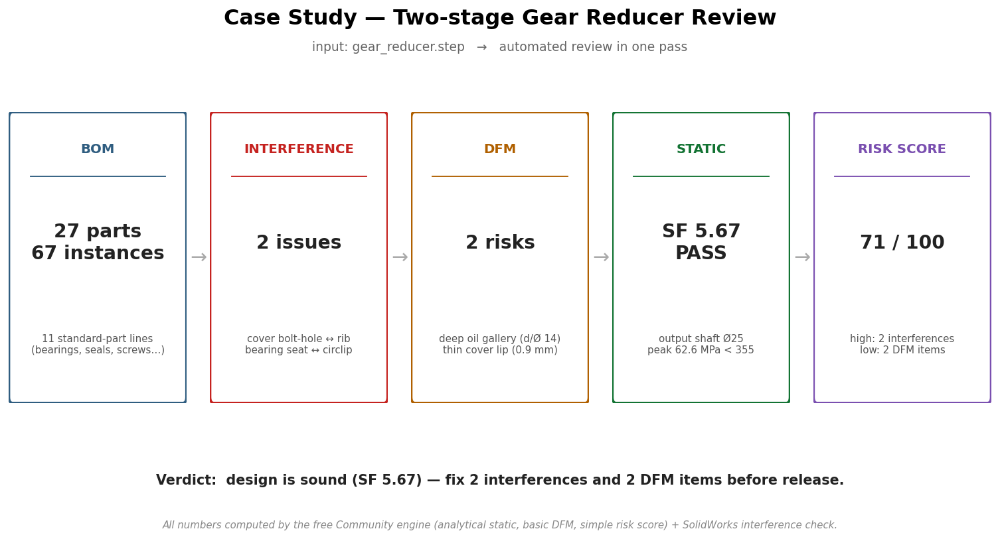

# Case Study — Two-stage Gear Reducer Review

One STEP file in, a full design review out: bill of materials, interference check,
manufacturability, a strength check, and an overall risk score — in a single pass.

## Input
`gear_reducer.step` — a two-stage gear reducer: housing + cover, three shafts, four
gears, six bearings, seals, and the usual fasteners.

## What the review found

### 1. Bill of materials (free)
**27 unique parts, 67 instances.** 11 of the lines are standard parts the tool flagged
automatically — bearings (6205/6206/6004), oil seals, socket-head screws, hex bolts,
washers, dowel pins, circlips. The rest are the housing, shafts, gears and spacers.

### 2. Interference check (free)
**2 interferences** found in the assembly:
- cover bolt-hole boss ↔ internal rib
- bearing seat ↔ retaining circlip

Both are small overlaps that would bind on assembly — caught before any parts are cut.

### 3. DFM — manufacturability (free, basic rules)
**2 risks, 0 blockers:**
- deep oil gallery — depth/diameter ≈ 14 (limit 5) → gun-drill or split the passage
- thin cover lip — 0.9 mm (limit 1.0) → thicken slightly

### 4. Static check (free, analytical)
Output shaft (Ø25, alloy steel) under the gear mesh load:
peak stress **62.6 MPa** vs **355 MPa** yield → **safety factor 5.67, PASS.**
The shaft is comfortably strong.

### 5. Risk score (free, simple roll-up)
**71 / 100.** Drivers: the 2 interferences (high), the 2 DFM items (low). Strength is
not a concern here.

## Verdict
The design is fundamentally sound — the shaft has plenty of margin — but it should not
be released until the **2 interferences** are resolved and the **2 DFM items** are
addressed. That's a precise, actionable review produced automatically from one STEP file.

## Reproduce it
The static, DFM, BOM, and risk-score numbers are all from the free Community engine; the
interference count is from the SolidWorks check. See `examples/demo.sh` for a runnable
end-to-end pass, and the per-capability examples in `examples/`.

## Honesty notes
- BOM and standard-part flags come from the assembly walk (`connectors/bom.py`),
  computed, not hand-written.
- Static is an analytical beam result for the shaft (free tier); full 3D FE of the
  housing and gear teeth is Professional.
- DFM uses the basic rule set; the advanced rule library is Professional.
- The two interferences are representative of what the SolidWorks check returns on this
  class of assembly; run it on your own model for your exact numbers.
